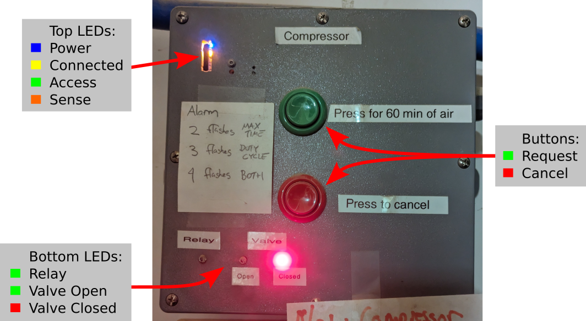

# FCCH Air Compressor Controller Manual

## Introduction

The "Watchdog" board, or air compressor controller, controls:
* Power to the compressor.
* Whether the output valve is open or closed.

The controller simply controls power to the compressor. Whether it actually
runs or not is determined autonomously by the compressor itself, based on the
air pressure in the tank, just like any normal compressor.

The controller accepts requests to turn on the compressor from the following
sources:
* Physical buttons on the controller.
* Our automation system, over the network. In practice, such requests are made
  whenever the LASER cutters are in use, or a blast gate needs to be activated.

The controller monitors whether the compressor is actually running (not
simply powered on) and checks for the follow alarm conditions:
* The compressor has been running non-stop for too long.
* The compressor has been running with too high a duty cycle for a long time.

The compressor will be turned on, and the output valve opened, if any
source has requested it, and there is no active alarm condition.

When an alarm condition is raised, the compressour is turned off, the output
valve is closed, and any request for the compressor to be on is forgotten.

An alarm condition is automatically cancelled after a certain time. There is no
way to manually cancel the alarm condition.

## User Control & Status Panel

### Buttons

If you want to use air in the wood shop, press the green button. Once you're
done, press the red button to cancel the request. Your request will also be
automatically cancelled after 1 hour; simply press the green button again if
you need air for longer.

### Top Status LEDs

Blue LED (Controller power):
* Always on if power is present.

Yellow LED (Connected):
* Off: WiFi disconnected.
* Flashing: WiFi connected, Automation/MQTT disconnected.
* On: WiFi & MQTT both connected.

Green LED (Access):
* Off: Compressor power is off, valve should be open.
* Flashing: Alarm: Flash count is alarm type.
* On: Compressor power is on, valve should be closed.

Alarm flash counts:
2: Max runtime exceeded.
3: Duty cycle exceeded.
4: Max and duty cycle exceeded.

Orange LED (Sense):
* Off: Compressor motor running.
* On: Compressor motor running.

### Bottom Status LEDs

Green (Relay):
* The compressor power is on.

Green (Valve Open):
* The compressor valve has reached the open position. It will take a few
seconds for this LED to light after the compressor is turned on. The LED lights
only after the valve reaches the fully open position.

Red (Valve Closed):
* The compressor valve has reached the closed position. It will take a few
seconds for this LED to light after the compressor is turned off. The LED lights
only after the valve reaches the fully closed position.

## Alarms

Any alarm condition indicates a problem that should be actively addressed. All
alarms indicate that the compressor is running outside of its specifications. It
is likely that if the controller did not automatically turn off the compressor,
it would overheat and fail. Assuming there is no air leak, an alarm condition
indicates that you should reduce air demand by lowering air pressure at the
equipment, or by using less equipment at the same time.

### Max Runtime Alarm

The compressor motor has been running non-stop for more than the configured
time limit. This indicates that the compressor outright cannot keep up with the
demand for air no matter how much it runs. 

### Duty Cycle Alarm

The compressor motor has been running for more that the configured percentage
of time over a configured time window. This indicates that compressor is
(perhaps only just) able to keep up with the demand for air, but the demand is
higher than expected, and higher than allowed by compressor specification.

### Causes Of an Alarm

The following situations may trigger an alarm:

* Too much concurrent usage. For example:
  * Both LASERs at high air assist pressure.
  * One LASER plus some medium use of the wood shop air hoses.
  * One LASER at very high air assist pressure.
  * High use of the wood shop air hoses.
* A leak in the air lines.

Either alarm may be caused by any condition; it simply boils down to how
excessive the demand is, and how long the demand lasts, vs. the compressor's
capabilities.

### Cancelling an Alarm

The controller automatically cancels all alarms after a configurable cooldown
period following the most recent time any alarm was triggered. There is not way
for a user to override this; you must simply wait for the cooldown period.

Once the alarm condition has been cancelled, a new request must be made before
the controller will turn on the compressor again. This could be by:

* Placing an RFID onto a piece of equipment. Note that this must be a fresh
  read of the RFID; simply leaving the RFID on the equipment is not enough.
* Pressing the request button on the control panel. Again, this will only be
  registered if it happens after the alarm condition is cancelled.

## Implementation Details

TODO

## Configuration Parameters

TODO
